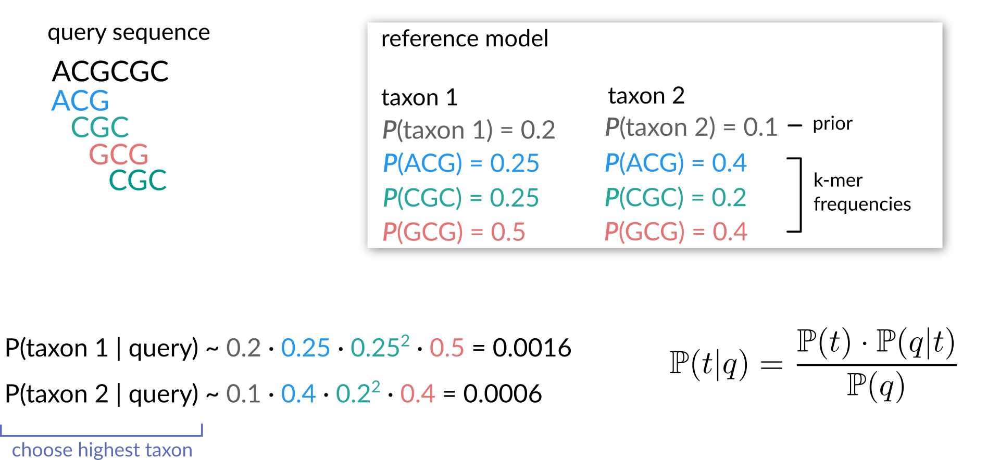

<!-- .slide: data-background="assets/isb/data-midnight.jpg" class="dark" -->

# Amplicon Sequencing Data Analysis with QIIME 2

### Christian Diener, Gibbons Lab


from the *ISB Microbiome Course 2020*

<br>
<div class="footer">
<a href="https://creativecommons.org/licenses/by-nc/4.0/"><i class="fa fa-bullhorn"></i>CC-BY-NC</a>
<a href="https://gibbons.isbscience.org/"><i class="fa fa-globe"></i>gibbons.isbscience.org</a>
<a href="https://github.com/gibbons-lab"><i class="fa fa-github"></i>gibbons-lab</a>
<a href="https://twitter.com/thaasophobia"><i class="fa fa-twitter"></i>@thaasophobia </a>
</div>

---

<!-- .slide: data-background="var(--primary)" class="dark" -->

# Hold your horses :horse:

Let's get the slides first (use your computer, phone, TV, fridge, anything with a 16:9 screen)

*https://gibbons-lab.github.io/isb_course_2020/16S*

---

# Organization of the course

<!-- .slide: data-background="var(--primary)" class="dark" -->


<br>

<a href="https://colab.research.google.com/github/gibbons-lab/isb_course_2020/blob/master/16S.ipynb"
   target="_blank">Click me to open the notebook!</a>

---

<!-- .slide: data-background="var(--primary)" class="dark" -->

# Setup

:computer: Let's switch to the notebook and get started

---

### Wait... what?


*All* output we generate can be found in the `treasure_chest` folder at

https://github.com/gibbons-lab/isb_course_2020/treasure_chest

or `materials/treasure_chest` in the Colaboratory notebook.

---

<!-- .slide: data-background="var(--secondary)" class="dark" -->

# QIIME

Pronounced like *chime*.

Created ~2010 during the Human Microbiome Project (2007 - 2016) under the leadership
of Greg Caporaso and Rob Knight.

---

## What is QIIME?

> QIIME 2 is a powerful, extensible, and decentralized microbiome
analysis package with a focus on data processing and analysis transparency.

*Q*uantitative *i*nsights *i*nto *M*icrobial *E*cology

---

## So what is it really?

Essentially, QIIME is a set of *commands* to transform microbiome *data* into
*intermediate outputs* and *visualizations*.


It's commonly used via the *command line*.

---

[QIIME 2](https://doi.org/10.1038/s41587-019-0209-9)
was introduced in 2016 and improves upon QIIME 1, based on user experiences during the HMP.

Major changes:

- integrated tracking of *data provenance*
- semantic *type system*
- extendable *plugin* system
- multiple *user interfaces* (in progress)


---

## Where to find help?

QIIME 2 comes with a lot of help, including a wide range of [tutorials](https://docs.qiime2.org/2021.4/tutorials/),
[general documentation](https://docs.qiime2.org/2021.4/) and a
[user forum](https://forum.qiime2.org/) where you can ask questions.

---

## Artifacts, actions and visualizations

QIIME 2 manages *artifacts*, which are basically intermediate data that feed
into *actions* to either produce other artifacts or *visualizations*.


<div class="footnote">

https://docs.qiime2.org/2021.4/tutorials/overview/

</div>

---

## Remember

Artifacts often represent *intermediate steps*, but Visualizations are *end points*
meant for human consumption :point_up:.

---

## What is amplicon sequencing?


---

<!-- .slide: data-background="var(--primary)" class="dark" -->

## Analyzing gut microbial composition during recurrent <i>C. diff</i> infections

16S amplicon sequencing data of the V4 region from human fecal samples

4 healthy donors and 4 individuals with recurrent infection.

https://doi.org/10.1186/s40168-015-0070-0

---


## The <i>C. diff</i> infection cycle


<div class="footnote">

courtesy of [Stephanie Swegle](https://see.isbscience.org/steam2019/stephanie-3/)

</div>

---

## What will we do today?


---

## Illumina FastQ files (Basespace)


```plaintext
@SRR2143527.13917 13917 length=251
TACGTAGGTGGCGAGCGTTATCCGGAATTATTGGGCGTAAA...
+
BBBBAF?A@D2BEEEGGGFGGGHGGGCFGFHHCFHCEFGGH...
```

---

We have our raw sequencing data but QIIME 2 only operates on artifacts. How
do we convert our data into an artifact??

:egg: or :hatched_chick:?

---

<!-- .slide: data-background="var(--primary)" class="dark" -->

## Our first QIIME 2 commands

:computer: Let's switch to the notebook and get started

---

## Time to bring in the big guns :bomb::zap:

We will now run the DADA2 plugin, which will do 3 things:

1. filter and trim the reads
2. find the most likely original sequences in the sample (ASVs)
3. remove chimeras
4. count the abundances

---

## Preprocessing sequencing reads

1. trim low quality regions
2. remove reads with low average quality
3. remove reads with ambiguous bases (Ns)
4. remove PhiX (added to sequencing)

---

## Identifying alternative sequence variants (ASVs)


Expectation-Maximization (EM) algorithm to find alternative sequence variants
(ASVs) and the real error model at the same time.

---

## PCR chimeras


The primers used in this study were F515/R806. How long is the amplified fragment?

---

We now have a table containing the counts for each ASV in each sample.
We also have a list of ASVs.

<br>

:thinking_face: Do you have an idea for what we could do with those two data sets? What quantities
might we be interested in?

---

<!-- .slide: data-background="var(--primary)" class="dark" -->

## Diversity metrics

In microbial community analysis we are usually interested in two different families of diversity metrics,
*alpha diversity* (ecological diversity within a sample) and *beta diversity* (ecological differences between samples).

---

## Alpha diversity

How diverse is a single sample?


- *richness:* how many taxa do we observe (richness)?<br>
  → #observed taxa, Simpson index
- *evenness*: how evenly are abundances distributed across taxa?<br>
  → Evenness index
- *mixtures*: metrics that combine both richness and evenness<br>
  → Shannon index

---

## Statistical tests for alpha diversity

Alpha diversity will provide a single value/covariate for each sample.

It can be treated as any other sample measurement and is suitable for classic
univariate tests (t-test, Mann-Whitney U test).

---

## Beta diversity

How different are two or more samples/donors/sites from one another other?


- *unweighted:* how many taxa are *shared* between samples?<br>
  → Jaccard index, unweighted UniFrac
- *weighted:* do shared taxa have *similar abundances*?<br>
  → Bray-Curtis distance, weighted UniFrac

---

### UniFrac

Do samples share *genetically similar* taxa?


Weighted UniFrac scales branches by abundance.

---

## How to build a phylogenetic tree?

One of the basic things we might want to look at is how the sequences across
all samples are related to one another. That is, we are often interested in their *phylogeny*.

Phylogenetic trees are built from *multiple sequence alignments* and sequences are
arranged by *sequence similarity* (branch length).

---

You can visualize your tree using iTOL (https://itol.embl.de/).


---

## Principal Coordinate Analysis


---

## Statistical tests for beta diversity

More complicated. Usually not normal and very heterogeneous. PERMANOVA can deal with that.


---

<!-- .slide: data-background="var(--primary)" class="dark" -->

## Run the diversity analyses

:computer: Let's switch to the notebook and calculate the diversity metrics

---

<!-- .slide: data-background="var(--primary)" class="dark" -->

## But what organisms are there in our sample?

We are still just working with sequences and have no idea what *organisms*
those correspond to.

<br>

:thinking_face: What would you do to go from a sequence to an organism's name?

---

## Taxonomic ranks


---

Even though directly aligning our sequences to a *database of known genes*
seems most intuitive, this does not always work well in practice. Why?

---

## Multinomial Naive Bayes



Instead, use *subsequences (k-mers)* and their counts to *predict* the
lineage/taxonomy with *machine learning* methods. For 16S amplicon fragments this
often provides better *generalization* and faster results.

---

<!-- .slide: data-background="var(--primary)" class="dark" -->

## Let's assign taxonomy to the samples

:computer: Let's switch to the notebook and assign taxonomy to our ASVs

---

## Your turn

What is the relationship between particular *taxa* and the disease state?


---

<!-- .slide: data-background="var(--primary)" class="dark" -->

### And we are done :clap:

# Thanks!

