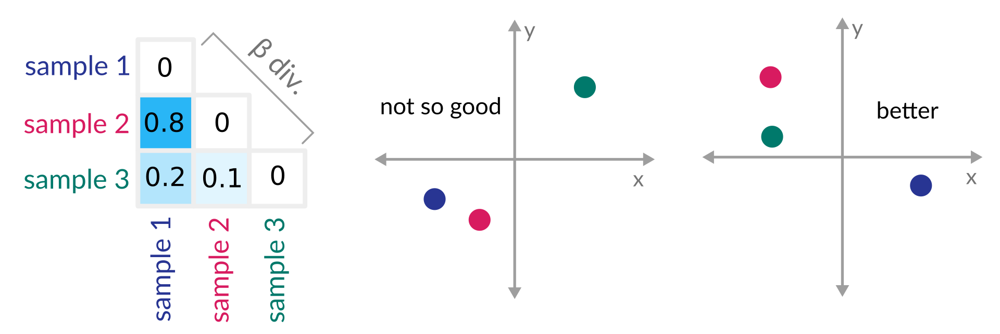

<!-- .slide: data-background="assets/isb/data-midnight.jpg" class="dark" -->

# Amplicon Sequencing Data Analysis with Qiime 2

### Christian Diener & Sean M. Gibbons


from the *ISB microbiome course*

https://gibbons-lab.github.io/isb_course_2020/16S

---

<!-- .slide: data-background="var(--primary)" class="dark" -->

# Before we start...

Will be managing 2 resources today.

Logic and explanation will be in the *slides* ("*Why* do we run the analysis?").

Technical aspects and commands can be found in the *colaboratory* notebook ("*How* do we run the analysis?").

---

Open up the presentation and the Google Colab notebook for this session:

- Presentation: https://gibbons-lab.github.io/isb_course_2020/16S

<a href="https://colab.research.google.com/github/gibbons-lab/isb_course_2020/blob/master/16S.ipynb"
   target="_blank">Click me to open the notebook!</a>

---

<!-- .slide: data-background="var(--primary)" class="dark" -->

# Intro to Colaboratory and environment setup

Follow the first few steps in the notebook...

We'll continue while that is running.

---

<!-- .slide: data-background="var(--secondary)" class="dark" -->

# what is Qiime?

Created ~2010 during the Human Microbiome Project (2007 - 2016) under leadership
of Greg Caporaso and Rob Knight.

---

## What is Qiime?

> QIIME 2 is a powerful, extensible, and decentralized microbiome
analysis package with a focus on data and analysis transparency.

*Q*uantitative *i*nsights *i*nto *M*icrobial *E*cology

---

## So what is it really?

In its essence Qiime is a set of *commands* to transform microbiome *data* into
*intermediate* outputs and *visualizations*.


Its major mode of use is via the *command line*.

---

*Qiime 2* was introduced 2016 and improves on Qiime 1 based on the experiences
during the HMP.

Major changes:

- integrated tracking of *data provenance*
- semantic *type system*
- extendable *plugin* system
- multiple *user interfaces* (in progress)

---

## Where to find help?

Qiime 2 comes with a lot of help starting from https://qiime2.org such
as [tutorials](https://docs.qiime2.org/2020.6/tutorials/),
[general documentation](https://docs.qiime2.org/2020.6/) and a
[user forum](https://forum.qiime2.org/) to ask questions.

---

## Artifacts, actions and visualizations

Qiime 2 manages *artifacts* which is basically intermediate data that is fed
to *actions* to either produce other artifacts or *visualizations*.


---

## Remember

Artifacts can be *intermediate steps*, but Visualizations are *end points*
meant for human consumption :point_up:.

---

<!-- .slide: data-background="var(--primary)" class="dark" -->

# Walkthrough I

## Analyzing the microbial composition in colorectal cancers

---

### Wait... what?


*All* output we generate can be found in the `treasure_chest` folder at

https://github.com/gibbons-lab/isb_course_2020/treasure_chest

or `materials/treasure_chest` in the colaboratory notebook.

---

<!-- .slide: data-background="assets/lab.jpg" class="dark" -->

## Our data

16S amplicon sequencing data of the V4 region from fecal samples

16 healthy donors and 16 donors with colorectal cancer (CRC).

2 studies in the data:

- https://doi.org/10.1158/1940-6207.CAPR-14-0129
- https://doi.org/10.1186/s13073-016-0290-3

---

## What will we do today?


---

## Illumina FastQ files (Basespace)


```plaintext
@SRR2143527.13917 13917 length=251
TACGTAGGTGGCGAGCGTTATCCGGAATTATTGGGCGTAAA...
+
BBBBAF?A@D2BEEEGGGFGGGHGGGCFGFHHCFHCEFGGH...
```

---

We have our raw sequencing data but Qiime 2 only operates on artifacts. How
do we convert our data to an artifact?

:egg: ↔ :hatched_chick:

---

## Our first Qiime 2 commands

We can import the data with the `import` action. For that we have to give
Qiime 2 a *manifest* (list of raw files) and tell it what *type of data* we
are importing and what *type of artifact* we want.

:computer: let's jump back to the open colaboratory notebook...

---

## View a Qiime 2 visualization

There are two ways to look at a Qiime 2 visualization:

- visit https://view.qiime2.org and load the file
- use `qiime tools view [file.qzv]` if you ahve Qiime 2 installed

:thinking_face: What do you observe across the read? Where would you truncate the reads?

---

Qiime 2 commands can become pretty long. Here some pointers to remember the
structure of a command:

```
qiime plugin action --i-argument1 ... --o-argument2 ...
```

Argument types usually begin with a letter denoting their meaning:

- `--i-...` = input files
- `--o-...` = output files
- `--p-...` = parameters
- `--m-...` = metadata

---

## Time to bring in the big guns :bomb::zap:

We will now run the DADA2 plugin which will do 3 things:

1. filter and trim the reads
2. find the most likely original sequences in the sample (ASVs)
3. remove chimeras
4. count the abundances

Alternatively just pull the pre-computed data with:

```sh
cp -r materials/treasure_chest/dada2 ~
```

---

## Identifying alternative sequence variants (ASVs)


Expectation-Maximization (EM) algorithm to find alternative sequence variants
(ASVs) and the real error model at the same time.

---

## PCR chimeras


---

We now have a table containing the counts for each ASV in each sample.
We also have a list of ASVs.

<br>

:thinking_face: Do you have an idea what we could do with those two data sets? What quantities
might we be interested in?

---

## Relationship between ASVs

One of the basic things we might want to see is how the sequences across
all samples are related to one another. We are interested in their *phylogeny*.

<br>

We can build a phylogenetic tree for our sequences using the following command:

```bash
qiime phylogeny align-to-tree-mafft-fasttree \
    --i-sequences dada2/representative_sequences.qza \
    --output-dir tree
```

---

You can visualize your tree using iTOL (https://itol.embl.de/).


---

<!-- .slide: data-background="var(--primary)" class="dark" -->

## Diversity

In microbial community analysis we are usually interested in two different diversity quantities,
*alpha diversity* and *beta diversity*.

---

## Alpha diversity

How diverse is a single sample?

<br>

- how many taxa do we observe (richness)? → #observed taxa
- are taxa equally abundant or are there rare/dominant taxa? → Shannon, Evenness

---

## Beta diversity

How different are two or more samples/donors/sites from each other?

<br>

- how many taxa are *shared* between samples? → Jaccard index
- do shared taxa have the *same abundance*? → Bray-Curtis distance
- do samples share *phylogenetically similar* taxa? → UniFrac, Faith PD

---

We can create a whole bunch of diversity metrics with Qiime 2 at once.

```bash
qiime diversity core-metrics-phylogenetic \
    --i-table dada2/table.qza \
    --i-phylogeny tree/rooted_tree.qza \
    --p-sampling-depth 8000 \
    --m-metadata-file samples.tsv \
    --output-dir diversity
```

----

## Principal Coordinate Analysis



<a href="data/weighted_unifrac/data" target="_blank">:bar_chart: See output...</a>

---

We can also use the diversity plugin to check if there are differences in
alpha diversity between groups:

```bash
qiime diversity alpha-group-significance \
    --i-alpha-diversity diversity/shannon_vector.qza \
    --m-metadata-file samples.tsv \
    --o-visualization diversity/alpha_groups.qzv
```

<br>

<a href="data/alpha_shannon/data" target="_blank">:bar_chart: See output...</a>

---

<!-- .slide: data-background="var(--primary)" class="dark" -->

## But what organisms are there in our sample?

We are still just working with sequences and have no idea what *organisms*
those correspond to.

<br>

:thinking_face: What would you do to go from a sequence to an organism/bacteria?

---

Even though just looking for our sequence in a *database of known genes*
seems like the best idea that does not work great in practice. Why?

<br>

More elaborate methods use *subsequences (k-mers)* and their counts to *predict* the
lineage/taxonomy with *machine learning* methods. For 16S amplicon fragments this
provides better *generalization*.

---

We will use a classifier trained on the GreenGenes database.

https://docs.qiime2.org/2020.2/data-resources/

```bash
qiime feature-classifier classify-sklearn \
    --i-reads dada2/representative_sequences.qza \
    --i-classifier gg-13-8-99-515-806-nb-classifier.qza \
    --o-classification taxa.qza
```

---

Now let's have a look what and how much of different bacteria we have in
each sample:

<br>

```bash
qiime taxa barplot \
    --i-table dada2/table.qza \
    --i-taxonomy taxa.qza \
    --m-metadata-file samples.tsv \
    --o-visualization taxa_barplot.qzv
```

<br>

:thinking_face: What do you observe? Can you find things that look interesting in the
cancer samples?

----

## Phylogenetic ranks


<br>

<a href="data/barplot/data" target="_blank">:bar_chart: See output...</a>

---

<!-- .slide: data-background="var(--secondary)" class="dark" -->

# Walkthrough II

## Differential abundance testing

---

In a metagenome analysis differential abundance testing is the use of
of *statistical tests* to identify *taxa* that are different across
a *phenotype* of interest (for instance case vs. control).

---

## Questions we should ask

1. What *preprocessing/transformation* do I apply to the abundances (biases)?
2. At which *taxonomy rank* should I test?
3. What *test* do I use (parametric, non-parametric, Bayesian)
4. How do I control for *multiple testing*?

---

<!-- .slide: data-background="var(--primary)" class="dark" -->

## Data transformations

Converting abundances to relative abundances (percent) makes the data
*compositional*, meaning the relative abundance of one taxon depends
on the others.

> A sample can not have 80% B. fragilis and 50% E. coli at the same time.

Loading the sequencer itself already introduces some compositional effect
as well (constant amount of DNA).

---

*Compositional* data usually violates *independence* assumptions of most
statistical tests.

There are many strategies to deal with that. Log-ratios work pretty
well in most cases.

---

## Compositional testing in Qiime 2

Qiime 2 has a methods to test in compositional data. [ANCOM](https://www.ncbi.nlm.nih.gov/pubmed/26028277)
tests with single taxa and [GNEISS](https://msystems.asm.org/content/2/1/e00162-16) tests for balances between several
taxa.

:thinking_face: But which taxonomy rank should we use?

---

## Summarizing feature tables

In Qiime 2 we can summarize a feature table at a particular taxonomy rank
using the `collapse` method.

```bash
qiime taxa collapse \
    --i-table dada2/table.qza \
    --i-taxonomy taxa.qza \
    --p-level 6 \
    --o-collapsed-table genus.qza
```

---

## ANCOM

Qiime 2 has a method that improves testing for compositional data
called [ANCOM](https://www.ncbi.nlm.nih.gov/pubmed/26028277). It can not
deal with zero abundances so it needs us to add a *pseudo count* first.

<br>

```bash
qiime composition add-pseudocount --i-table genus.qza --o-composition-table added_pseudo.qza
```

```bash
qiime composition ancom \
    --i-table added_pseudo.qza \
    --m-metadata-file samples.tsv \
    --m-metadata-column status \
    --o-visualization ancom.qzv
```

<br>

<a href="data/ancom/data" target="_blank">:bar_chart: See output...</a>

---

## Choosing the right test

Parametric tests tend to have better *statistical power* but assumptions
about the underlying *distribution* might not be adequate for microbiome
data.

---

<!-- .slide: data-background="assets/hare.jpg" class="dark" -->

# Non-parametric tests

---

## Mann-Whitney U test (Wilcoxon rank-sum test)


---

## Faster way: use ranks


---

## The Artifact API

You can open a Python interpreter with typing `ipython` (close it with `Ctrl-D`).

```python
from qiime2 import Artifact
import pandas as pd

df = Artifact.load("percentile_normalized.qza").view(pd.DataFrame)
converted = Artifact.import_data("FeatureTable[Frequency]", df)
converted.save("pnorm_freq.qza")
```

---

<!-- .slide: data-background="var(--primary)" class="dark" -->

## Non-parametric testing

This is currently not included in Qiime 2. However, you can connect
your own scripts to Qiime 2.

See `wilcoxon_test.py`.

----

```sh
(qiime2) cdiener@moneta [ubc2018] python wilcoxon_test.py -h
usage: wilcoxon_test.py [-h] -i I -m M [-o O] [-a A] [-t T]

run rank sums tests on case-control dataset

optional arguments:
  -h, --help  show this help message and exit
  -i I        input OTU table qiime artifact (rows = samples, columns =
              phylotypes; default format = tab-delimited)
  -m M        case-control metadata with "disease_state" column
  -o O        output file name [default: rank_sums_results.txt]
  -a A        alpha-level for test
  -t T        occurence threshold in case or control
```

---

## Within study testing

Lets now look at the significant results in the following settings:

1. in the individual studies without normalization
2. in the pooled studies without normalization
3. in the pooled studies with percentile normalization

---

## Example: The Baxter study

```bash
python wilcoxon_test.py -i baxter_table.qza -m crc_metadata.tsv
```

This will generate a file `rank_sums_results.txt` with the taxonomy and
p-values for each significant results and a plot `p-value_histogram.png`
that contains the overall distribution of p-values.

http://varianceexplained.org/statistics/interpreting-pvalue-histogram/

---

## Your turn!


----

Run the differential tests for the data sets as specified before:

1. in the individual studies without normalization
2. in the pooled studies without normalization
3. in the pooled studies with percentile normalization

:thinking_face: What do you observe in terms of significant results and p-value distributions.

:thinking_face: What happens if you modify the significance (alpha) level or
the occurrence threshold?

----

# Solutions


----

```bash
python wilcoxon_test.py -i zeller_table.qza -m crc_metadata.tsv
```

```bash
python wilcoxon_test.py -i crc_dataset.qza -m crc_metadata.tsv
```

```bash
python wilcoxon_test.py -i pnorm_freq.qza -m crc_metadata.tsv
```

```bash
python wilcoxon_test.py -i pnorm_freq.qza -m crc_metadata.tsv -a 0.01 -t 0.1
```

---

<!-- .slide: data-background="var(--primary)" class="dark" -->

### And we are done :clap:

# Thanks!

---

# :bike: Too fast? :blue_car:

Here some more questions to investigate.

---

Are beta diversity differences explained by the phenotype?

How much variance is explained by healthy vs. disease?

What about batch effects?

https://docs.qiime2.org/2020.2/plugins/available/diversity/beta-group-significance/

---

Could you predict if someone had colorectal cancer just from 16S data?

Does pooling studies help here?

https://docs.qiime2.org/2020.2/plugins/available/sample-classifier/classify-samples/


