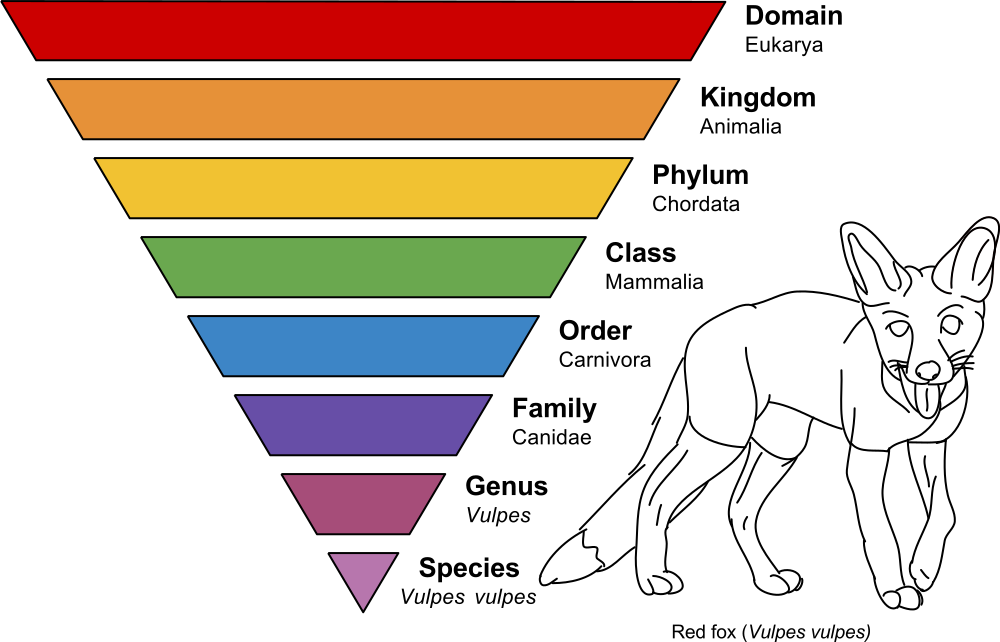

<!-- .slide: data-background="#3F51B5" class="dark" -->

# Qiime II for 16S Amplicon Sequence Analysis

### Christian Diener & Sean M. Gibbons


from the *CCMB workshop 2018*

https://gibbons-lab.github.io/ccmb_workshop

---

Created ~2010 during the Human Microbiome Project (2007 - 2016) under leadership
of Greg Caporaso and Rob Knight.

---

## What is Qiime?

> QIIME 2 is a powerful, extensible, and decentralized microbiome
analysis package with a focus on data and analysis transparency.

*Q*uantitative *i*nsights *i*nto *M*icrobial *E*cology

---

## So what is it really?

In its essence Qiime is a set of *commands* to transform microbiome *data* into
*intermediate* outputs and *visualization*.


Its major mode of use is via the *command line*.

---

*Qiime 2* was introduced 2016 and improves on Qiime 1 based on the experiences
during the HMP.

Major changes:

- integrated tracking of *data provenance*
- semantic *type system*
- extendable *plugin* system
- multiple *user interfaces* (in progress)

---

## Where to find help?

Qiime 2 comes with a lot of help starting from https://qiime2.org such
as [tutorials](https://docs.qiime2.org/2018.11/tutorials/),
[general documentation](https://docs.qiime2.org/2018.11/) and a
[user forum](https://forum.qiime2.org/) to ask questions.

---

## Artifacts, actions and visualizations

Qiime 2 manages *artifacts* which is basically intermediate data that is fed
to *actions* to either produce other artifacts or *visualizations*.


---

## Remember

Artifacts can be *intermediate steps*, but Visualizations are *end points*
meant for human consumption :point_up:.

---

<!-- .slide: data-background="#2962FF" class="dark" -->

# Walkthrough I

## Analyzing the microbial composition in colorectal cancers

---

## The setup

Qiime 2 currently only has native support for Mac and Linux.

It can also be deployed on a server or the [cloud](https://docs.qiime2.org/2018.11/install/virtual/aws/).

----

Goal for now: get a working Qiime 2 environment.

There might be some minor set up steps :point_right:

---

<!-- .slide: data-background="#00897B" class="dark" -->

# If you use Qiime 2 on a server...

----

<!-- .slide: data-background="#00897B" class="dark" -->

## Windows: Install Putty and WinSCP

----

### Putty

To connect to the server we will need a SSH client. You can download Putty
at https://www.chiark.greenend.org.uk/~sgtatham/putty/latest.html
(most likely the 64bit version).

Run the downloaded installer and you are set.

If you open Putty it will ask you for a server address your user
name and password and will connect you to the server.

----

### WinSCP

`WinSCP` will allow you to transfer files between you computer and the server.

Download it at https://winscp.net/eng/download.php .

After installing and running it will ask you for the same info as before. Choose
SFTP or SCP as the protocol (default) and provide the server address
your user and password.

----

<!-- .slide: data-background="#00897B" class="dark" -->

## Mac or Linux: Install nothing :stuck_out_tongue:

But you will need to open a terminal...

----

Type "terminal" in the application menu.

You can connect to the server with

```sh
ssh user@server
```
where `user` is your username and `server` the web address of the server.

You can transfer files using `rsync`

```sh
rsync user@server:~/file.txt .
```

---

<!-- .slide: data-background="#00897B" class="dark" -->

# If you want to install Qiime 2 on your own equipment?

https://docs.qiime2.org/2018.11/install/

----

## Mac or Linux: use conda

1. Install miniconda -> https://conda.io/miniconda.html
2. Get the conda environment file for [Mac](https://data.qiime2.org/distro/core/qiime2-2018.11-py35-osx-conda.yml)
   or [Linux](https://data.qiime2.org/distro/core/qiime2-2018.11-py35-linux-conda.yml)
3. Set up the Qiime 2 environment and activate it

```sh
conda env create -n qiime2-2018.11 --file qiime2-2018.11-py35-osx-conda.yml
source activate qiime2-2018.11
```

----

## Windows: use docker

No native support but you can run it with Docker (virtual machine alternative).

See https://store.docker.com/editions/community/docker-ce-desktop-windows.

With docker you can get the Qiime 2 container with:

```sh
docker pull qiime2/core:2018.11
```

Also see [this forum post](https://forum.qiime2.org/t/issue-with-docker-toolbox-install-mingw-path-conversion/735/2).

---

### Wait... what?


*All* output we generate can be found in the `treasure_chest` folder at

https://github.com/gibbons-lab/ccmb_workshop

---

<!-- .slide: data-background="assets/lab.jpg" class="dark" -->

## Our data

16S amplicon sequencing data of the V4 region from fecal samples

16 healthy donors and 16 donors with colorectal cancer (CRC).

2 studies in the data:

- https://doi.org/10.1158/1940-6207.CAPR-14-0129
- https://doi.org/10.1186/s13073-016-0290-3

---

## What will we do today?


---

Start by copying the [course materials](https://github.com/Gibbons-Lab/ccmb_workshop/archive/master.zip)
to a folder on your machine or the server.

For now we will use the following files:

1. `ubc_data` - directory with the sequencing data
2. `ubc_manifest.csv` - list of sequencing files
3. `samples.tsv` - metadata for the samples

---

## Illumina FastQ files (Basespace)


```plaintext
@SRR2143527.13917 13917 length=251
TACGTAGGTGGCGAGCGTTATCCGGAATTATTGGGCGTAAA...
+
BBBBAF?A@D2BEEEGGGFGGGHGGGCFGFHHCFHCEFGGH...
```

---

We have our raw sequencing data but Qiime 2 only operates on artifacts. How
do we convert our data to an artifact?

:egg: ↔ :hatched_chick:

---

## Activate your Qiime 2 environment :rocket:

```bash
source activate qiime2-2018.11
```

---

## Our first Qiime 2 command

We can import the data with the `import` action. For that we have to give
Qiime 2 a *manifest* (list of raw files) and tell it what *type of data* we
are importing and what *type of artifact* we want.

```bash
# use `\` to break up long lines
qiime tools import \
  --type 'SampleData[SequencesWithQuality]' \
  --input-path ubc_manifest.csv \
  --output-path ubc_data.qza \
  --input-format SingleEndFastqManifestPhred33
```

---

Since we have quality information for the sequencing reads, let's also generate
our first visualization by inspecting those:

```bash
qiime demux summarize --i-data ubc_data.qza --o-visualization qualities.qzv
```

Copy the file to your local machine.

---

## View a Qiime 2 visualization

https://view.qiime2.org

Have a <a href="data/qualities/data" target="_blank">:bar_chart:look</a> at the qualities.

:thinking_face: What do you observe across the read? Where would you truncate the reads?

---

Qiime 2 commands can become pretty long. Here some pointers to remember the
structure of a command:

```
qiime plugin action --i-argument1 ... --o-argument2 ...
```

Argument types usually begin with a letter denoting their meaning:

- `--i-...` = input files
- `--o-...` = output files
- `--p-...` = parameters
- `--m-...` = metadata

---

## Time to bring in the big guns :bomb::zap:

We will now run the DADA2 plugin which will do 3 things:

1. filter and trim the reads
2. find the most likely original sequences in the sample (ASVs)
3. remove chimeras
4. count the abundances

---

Since it takes a bit let's start the process and use the time to
understand what is happening:

```bash
qiime dada2 denoise-single \
    --i-demultiplexed-seqs ubc_data.qza \
    --p-trunc-len 220 --p-trim-left 10 \
    --output-dir dada2 --verbose
```

Alternatively just pull the pre-computed data with:

```sh
cp -r /srv/workshop/treasure_chest/dada2 ~
```

---

## Identifying alternative sequence variants


Expectation-Maximization (EM) algorithm to find alternative sequence variants
(ASVs) and the real error model at the same time.

---

## PCR chimeras


---

We now have a table containing the counts for each ASV in each sample.
We also have a list of ASVs.

<br>

:thinking_face: Do you have an idea what we could do with those two data sets? What quantities
might we be interested in?

---

## Relationship between ASVs

One of the basic things we might want to see is how the sequences across
all samples are related to one another. We are interested in their *phylogeny*.

<br>

We can build a phylogenetic tree for our sequences using the following command:

```bash
qiime phylogeny align-to-tree-mafft-fasttree \
    --i-sequences dada2/representative_sequences.qza \
    --output-dir tree
```

---

You can visualize your tree using iTOL (https://itol.embl.de/).


---

<!-- .slide: data-background="#00897B" class="dark" -->

## Diversity

In microbial community analysis we are usually interested in two different diversity quantities,
*alpha diversity* and *beta diversity*.

---

## Alpha diversity

How diverse is a single sample?

<br>

- how many taxa do we observe (richness)? → #observed taxa
- are taxa equally abundant or are there rare/dominant taxa? → Shannon, Evenness

---

## Beta diversity

How different are two or more samples/donors/sites from each other?

<br>

- how many taxa are *shared* between samples? → Jaccard index
- do shared taxa have the *same abundance*? → Bray-Curtis distance
- do samples share *phylogenetically similar* taxa? → UniFrac, Faith PD

---

We can create a whole bunch of diversity metrics with Qiime 2 at once.

```bash
qiime diversity core-metrics-phylogenetic \
    --i-table dada2/table.qza \
    --i-phylogeny tree/rooted_tree.qza \
    --p-sampling-depth 8000 \
    --m-metadata-file samples.tsv \
    --output-dir diversity
```

----

## Principal Coordinate Analysis


<a href="data/weighted_unifrac/data" target="_blank">:bar_chart: See output...</a>

---

We can also use the diversity plugin to check if there are differences in
alpha diversity between groups:

```bash
qiime diversity alpha-group-significance \
    --i-alpha-diversity diversity/shannon_vector.qza \
    --m-metadata-file samples.tsv \
    --o-visualization diversity/alpha_groups.qzv
```

<br>

<a href="data/alpha_shannon/data" target="_blank">:bar_chart: See output...</a>

---

<!-- .slide: data-background="#00897B" class="dark" -->

## But what organisms are there in our sample?

We are still just working with sequences and have no idea what *organisms*
those correspond to.

<br>

:thinking_face: What would you do to go from a sequence to an organism/bacteria?

---

Even though just looking for our sequence in a *database of known genes*
seems like the best idea that does not work great in practice. Why?

<br>

More elaborate methods use *subsequences (k-mers)* and their counts to *predict* the
lineage/taxonomy with *machine learning* methods. For 16S amplicon fragments this
provides better *generalization*.

---

We will use a classifier trained on the GreenGenes database.

https://docs.qiime2.org/2018.11/data-resources/

```bash
qiime feature-classifier classify-sklearn \
    --i-reads dada2/representative_sequences.qza \
    --i-classifier gg-13-8-99-515-806-nb-classifier.qza \
    --o-classification taxa.qza
```

---

Now let's have a look what and how much of different bacteria we have in
each sample:

<br>

```bash
qiime taxa barplot \
    --i-table dada2/table.qza \
    --i-taxonomy taxa.qza \
    --m-metadata-file samples.tsv \
    --o-visualization taxa_barplot.qzv
```

<br>

:thinking_face: What do you observe? Can you find things that look interesting in the
cancer samples?

----

## Phylogenetic ranks



<br>

<a href="data/barplot/data" target="_blank">:bar_chart: See output...</a>

---

<!-- .slide: data-background="#2962FF" class="dark" -->

# Walkthrough II

## Differential abundance testing

---

In a metagenome analysis differential abundance testing is the use of
of *statistical tests* to identify *taxa* that are different across
a *phenotype* of interest (for instance case vs. control).

---

## Questions we should ask

1. What *preprocessing/transformation* do I apply to the abundances (biases)?
2. At which *taxonomy rank* should I test?
3. What *test* do I use (parametric, non-parametric, Bayesian)
4. How do I control for *multiple testing*?

---

<!-- .slide: data-background="#00897B" class="dark" -->

## Data transformations

Converting abundances to relative abundances (percent) makes the data
*compositional*, meaning the relative abundance of one taxon depends
on the others.

> A sample can not have 80% B. fragilis and 50% E. coli at the same time.

Loading the sequencer itself already introduces some compositional effect
as well (constant amount of DNA).

---

*Compositional* data usually violates *independence* assumptions of most
statistical tests.

There are many strategies to deal with that. Log-ratios work pretty
well in most cases.

---

## Compositional testing in Qiime 2

Qiime 2 has a methods to test in compositional data. [ANCOM](https://www.ncbi.nlm.nih.gov/pubmed/26028277)
tests with single taxa and [GNEISS](https://msystems.asm.org/content/2/1/e00162-16) tests for balances between several
taxa.

:thinking_face: But which taxonomy rank should we use?

---

## Summarizing feature tables

In Qiime 2 we can summarize a feature table at a particular taxonomy rank
using the `collapse` method.

```bash
qiime taxa collapse \
    --i-table dada2/table.qza \
    --i-taxonomy taxa.qza \
    --p-level 6 \
    --o-collapsed-table genus.qza
```

---

## ANCOM

Qiime 2 has a method that improves testing for compositional data
called [ANCOM](https://www.ncbi.nlm.nih.gov/pubmed/26028277). It can not
deal with zero abundances so it needs us to add a *pseudo count* first.

<br>

```bash
qiime composition add-pseudocount --i-table genus.qza --o-composition-table added_pseudo.qza
```

```bash
qiime composition ancom \
    --i-table added_pseudo.qza \
    --m-metadata-file samples.tsv \
    --m-metadata-column status \
    --o-visualization ancom.qzv
```

<br>

<a href="data/ancom/data" target="_blank">:bar_chart: See output...</a>

---

## Choosing the right test

Parametric tests tend to have better *statistical power* but assumptions
about the underlying *distribution* might not be adequate for microbiome
data.

---

<!-- .slide: data-background="assets/hare.jpg" class="dark" -->

# Non-parametric tests

---

## Mann-Whitney U test (Wilcoxon rank-sum test)


---

## Faster way: use ranks


---

<!-- .slide: data-background="#2962FF" class="dark" -->

# Walkthrough III

## Percentile Normalization

---

<!-- .slide: data-background="assets/lab.jpg" class="dark" -->

# Even more data

We will continue using colorectal cancer data sets, but this time from a
larger cohort (408 donors).

1. Baxter study (https://doi.org/10.1186/s13073-016-0290-3, n=292)
2. Zeller study (https://doi.org/10.15252/msb.20145645, n=116)

You already have the counts with assigned taxa in the artifact
`crc_dataset.qza`. The metadata can be found in `crc_metadata.tsv`.

---

## Batch effects in the wild

As mentioned before diversity analysis might be a good initial step. To make
it easier on us we will only use the non-phylogenetic core metrics.

<br>

:thinking_face: do you remember the command? If not, does looking at the
[available plugins](https://docs.qiime2.org/2018.11/plugins/) help?

----

```bash
qiime diversity core-metrics \
    --i-table crc_dataset.qza \
    --p-sampling-depth 100000 \
    --m-metadata-file crc_metadata.tsv \
    --output-dir crc_diversity
```

Have a look at the Bray-Curtis PCoA plot and observe the batch effect.

<a href="data/crc_bray/data" target="_blank">:bar_chart: See output...</a>

:thinking_face: Why is this likely a batch effect and not biological signal?

---

## Running percentile normalization

There is a Qiime 2 plugin for percentile normalization by Claire Duvallet.
In an existing Qiime 2 installation you can get it with

```sh
conda install -c cduvallet q2_perc_norm
```

It is already installed on the server :tada:

----

The Qiime 2 perc-norm plugin only operates on relative frequency tables,
so let us first convert our table into that format...

```bash
qiime feature-table relative-frequency \
	--i-table crc_dataset.qza \
	--o-relative-frequency-table crc_relative.qza
```

Now we can continue with the actual normalization :point_down:

----

```bash
qiime perc-norm percentile-normalize \
	--i-table crc_relative.qza \
	--m-metadata-file crc_metadata.tsv \
	--m-metadata-column disease_state \
	--m-batch-file crc_metadata.tsv \
	--m-batch-column study \
	--p-otu-thresh 0.0 \
	--o-perc-norm-table percentile_normalized.qza
```

---

Cool, we have our normalized data. Let's just plug that into the other
Qiime 2 actions...


----

`percentile_normalized.qza` has the type `FeatureTable[PercentileNormalized]`
but most Qiime 2 actions want a `FeatureTable[Frequency]`.

---

## Qiime 2 does let you work around that :nerd_face:

But you will *lose provenance* and should make sure what you do *makes sense*.

:thinking_face: Does it make sense to rarefy a `FeatureTable[PercentileNormalized]`?

----

## The Artifact API

You can open a Python interpreter with typing `ipython` (close it with `Ctrl-D`).

```python
from qiime2 import Artifact
import pandas as pd

df = Artifact.load("percentile_normalized.qza").view(pd.DataFrame)
converted = Artifact.import_data("FeatureTable[Frequency]", df)
converted.save("pnorm_freq.qza")
```

---

## PCoA of the normalized data

We do not want to rarefy this time so we have to build up the PCoA steps
ourselves (can not use `qiime diversity core-metrics`).

:thinking_face: Could you come up with the commands yourselves? Think about the
data (artifacts) you will need for each step...

Solution :point_down:

----

### Step 1: Get the Bray-Curtis distance matrix

```bash
qiime diversity beta \
    --i-table pnorm_freq.qza \
    --p-metric braycurtis \
    --o-distance-matrix pnorm_bray.qza
```

----

### Step 2: Calculate the PCoA

```bash
qiime diversity pcoa --i-distance-matrix pnorm_bray.qza --o-pcoa pnorm_pcoa.qza
```

----

### Step 3: Visualize with Emperor

```bash
qiime emperor plot \
    --i-pcoa pnorm_pcoa.qza \
    --m-metadata-file crc_metadata.tsv \
    --o-visualization pnorm_pcoa_emperor.qzv
```

<a href="data/pnorm_pcoa/data" target="_blank">:bar_chart: See output...</a>

---

<!-- .slide: data-background="#00897B" class="dark" -->

## Non-parametric testing

This is currently not included in Qiime 2. However, you can connect
your own scripts to Qiime 2.

See `wilcoxon_test.py`.

----

```sh
(qiime2) cdiener@moneta [ubc2018] python wilcoxon_test.py -h
usage: wilcoxon_test.py [-h] -i I -m M [-o O] [-a A] [-t T]

run rank sums tests on case-control dataset

optional arguments:
  -h, --help  show this help message and exit
  -i I        input OTU table qiime artifact (rows = samples, columns =
              phylotypes; default format = tab-delimited)
  -m M        case-control metadata with "disease_state" column
  -o O        output file name [default: rank_sums_results.txt]
  -a A        alpha-level for test
  -t T        occurence threshold in case or control
```

---

## Within study testing

Lets now look at the significant results in the following settings:

1. in the individual studies without normalization
2. in the pooled studies without normalization
3. in the pooled studies with percentile normalization

---

## Separating the studies

A data set can be stratified with the `feature-table` plugin:

```bash
qiime feature-table filter-samples \
	--i-table crc_dataset.qza \
	--m-metadata-file crc_metadata.tsv \
	--p-where "study=='baxter'" \
	--o-filtered-table baxter_table.qza
```

...and for the second study:

```bash
qiime feature-table filter-samples \
	--i-table crc_dataset.qza \
	--m-metadata-file crc_metadata.tsv \
	--p-where "study=='zeller'" \
	--o-filtered-table zeller_table.qza
```

---

## Example: The Baxter study

```bash
python wilcoxon_test.py -i baxter_table.qza -m crc_metadata.tsv
```

This will generate a file `rank_sums_results.txt` with the taxonomy and
p-values for each significant results and a plot `p-value_histogram.png`
that contains the overall distribution of p-values.

http://varianceexplained.org/statistics/interpreting-pvalue-histogram/

---

## Your turn!


----

Run the differential tests for the data sets as specified before:

1. in the individual studies without normalization
2. in the pooled studies without normalization
3. in the pooled studies with percentile normalization

:thinking_face: What do you observe in terms of significant results and p-value distributions.

:thinking_face: What happens if you modify the significance (alpha) level or
the occurrence threshold?

----

# Solutions


----

```bash
python wilcoxon_test.py -i zeller_table.qza -m crc_metadata.tsv
```

```bash
python wilcoxon_test.py -i crc_dataset.qza -m crc_metadata.tsv
```

```bash
python wilcoxon_test.py -i pnorm_freq.qza -m crc_metadata.tsv
```

```bash
python wilcoxon_test.py -i pnorm_freq.qza -m crc_metadata.tsv -a 0.01 -t 0.1
```

---

<!-- .slide: data-background="#3F51B5" class="dark" -->

### And we are done :clap:

# Thanks!

---

# :bike: Too fast? :blue_car:

Here some more questions to investigate.

---

Are beta diversity differences explained by the phenotype?

How much variance is explained by healthy vs. disease?

What about batch effects?

https://docs.qiime2.org/2018.11/plugins/available/diversity/beta-group-significance/

---

Could you predict if someone had colorectal cancer just from 16S data?

Does pooling studies help here?

https://docs.qiime2.org/2018.11/plugins/available/sample-classifier/classify-samples/


